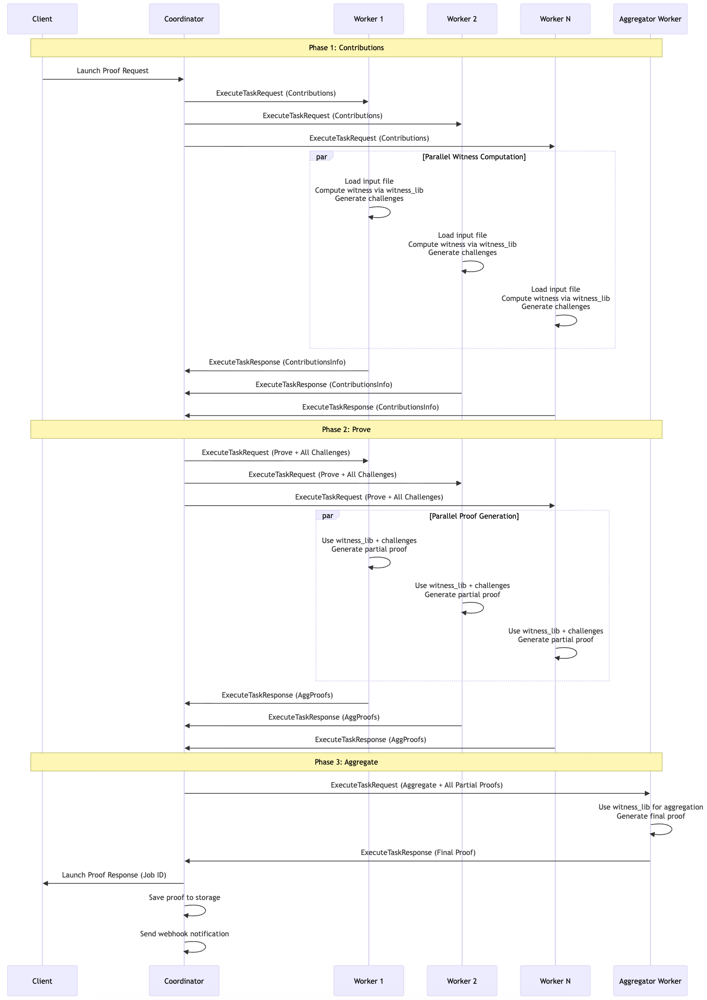

# Distributed Proof Generation With ZisK

## Overview

ZisK's distributed proof generation system enables horizontal scaling of proof workloads across multiple machines. Instead of generating proofs on a single machine, the system orchestrates proof generation across a pool of worker nodes, significantly reducing proof generation time for large or complex programs.

---
## What is Distributed Proof Generation in ZisK?

Distributed proof generation in ZisK splits computationally intensive proof workloads across multiple machines, allowing parallel execution of proof generation tasks. The system uses a Coordinator-Worker architecture:

- **Coordinator** receives proof requests, manages worker pools, and orchestrates the 3-phase proof workflow.
- **Workers** execute actual proof computations independently and report results back to the coordinator.

The system uses gRPC bidirectional streaming for asynchronous communication, enabling workers to process tasks independently while the coordinator manages job lifecycles and aggregates results.

---

## System Architecture

The distributed proving system uses a **Coordinator-Worker architecture** where a central coordinator orchestrates proof generation across multiple computational workers. This design enables horizontal scaling by distributing computationally intensive proof workloads across available machines.

### Coordinator

The **Coordinator** acts as the central brain of the system, managing the entire proof generation lifecycle. It receives proof requests from clients, maintains a registry of available workers, and intelligently distributes work based on each worker's reported compute capacity. The coordinator orchestrates the three-phase proof generation workflow (Contributions → Prove → Aggregate), monitors worker health through heartbeat mechanisms, and aggregates results to deliver final proofs back to clients.

**Key characteristics:**
- **Stateful coordination**: Maintains job state and worker registry but doesn't perform computations
- **High availability**: Single point of coordination with fault tolerance
- **Scalable**: Can manage hundreds of workers simultaneously
- **gRPC interface**: Exposes API for clients and administrative operations

### Worker

**Workers** are self-contained computational units that perform the actual proof generation work. Each worker registers with the coordinator, reports its compute capacity, and waits for task assignments. When assigned work, workers independently load the required files (ELF programs, proving keys, witness library, and input data), execute the three-phase proof generation process, and report results back to the coordinator.

**Key characteristics:**
- **Local witness computation**: Each worker computes witness data locally (never transmitted over network)
- **Flexible deployment**: Can run on CPU or GPU with appropriate build flags
- **MPI support**: Can operate as single machines or MPI clusters for additional parallelization
- **Independent operation**: Self-contained units that can process tasks autonomously

---

## How Distributed Proving with ZisK Works

**TL;DR:** As discussed above, the architecture for ZisK's distributed proving is composed of two main actors:

- **Coordinator**: Manages incoming proof requests and splits the work, based on required compute capacity, across distributed available workers.
- **Worker**: Registers with the coordinator, reporting its compute capacity, and waits for tasks to be assigned. The worker can be a single machine or a cluster of machines.

The process of generating a proof proceeds as follows:

1. The Coordinator starts on a host and listens for incoming proof requests.
2. Worker nodes connect to the Coordinator, registering their compute capacity and availability.
3. When a proof generation request is received, the Coordinator splits the work across multiple Workers according to the requested compute capacity (in a simple round-robin format). The proof generation job is divided into three phases:
   - **Partial Contributions**: Each Worker computes its partial challenges.
   - **Prove**: Workers compute the global challenge and generate their respective partial proofs.
   - **Aggregation**: A designated Worker aggregates all partial proofs and produces the final proof for the client (ideally the worker that finishes first becomes the aggregator)
4. The Coordinator collects the final proof and returns it to the client.

It's a combination of gRPC and MPI coordination to help generate the proof. 

---

## Key Concepts

- **Compute Capacity**
  - Workers report their computational capacity in **compute units** (e.g., 4, 8, 16 units).
  - The coordinator matches proof requests to available worker capacity and distributes work using round-robin allocation.

- **Aggregator Selection**
  - The first worker to complete Phase 2 becomes the aggregator.
  - This aggregator is responsible for combining all partial proofs into the final proof.
  - Other workers are freed immediately after sending their partial proofs.

- **Local Witness Computation**
  - Each worker computes witness data locally; this data is never transmitted over the network.
  - Only cryptographic challenges, partial proofs, and the final proof are transmitted between the coordinator and workers.

- **Communication**
  - Workers maintain persistent bidirectional gRPC streams with the coordinator for real-time task assignment and result reporting.
  - The coordinator also exposes administrative APIs for monitoring system status, job progress, and worker health.

<!-- Updated content -->

---

## What's Next:

Ready to set up distributed proving? Continue to:

- **[Manual Deployment](./manual-deployment.md)** - Step-by-step setup, commands, and testing
- **[Docker Deployment](./docker-deployment.md)** - Containerized deployment with Docker
- **[Distributed System Configuration](./configuration-guide.md)** - Complete configuration reference and troubleshooting
