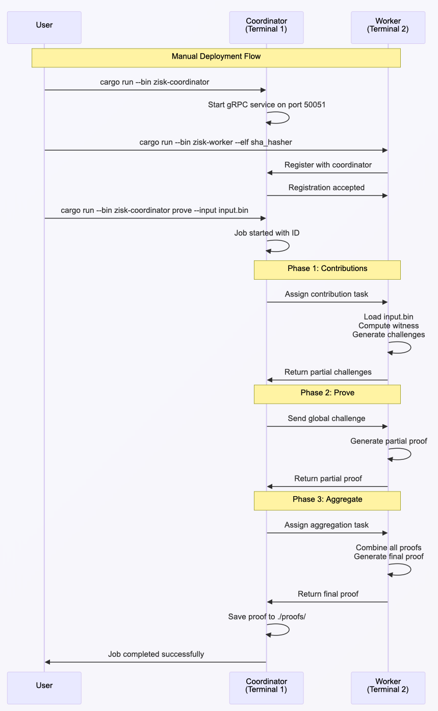

# Manual Deployment

## Overview

This guide demonstrates how to manually deploy ZisK's distributed proving system locally using a SHA hasher program as an example. The distributed system enables horizontal scaling of proof generation workloads by orchestrating proof tasks across multiple worker nodes, allowing you to distribute computationally intensive proving operations across multiple machines for improved performance and throughput.

## Table of Contents

- [Prerequisites](#prerequisites)
- [Complete Example: SHA Hasher](#complete-example-sha-hasher)
  - [Step 1: Build the Distributed System](#step-1-build-the-distributed-system)
  - [Step 2: Start the Coordinator](#step-2-start-the-coordinator)
  - [Step 3: Start a Worker](#step-3-start-a-worker)
  - [Step 4: Generate a Proof](#step-4-generate-a-proof)
  - [Step 5: Monitor the Three-Phase Process](#step-5-monitor-the-three-phase-process)
  - [Step 6: Verify Results](#step-6-verify-results)
- [Next Steps](#next-steps)

---

## Prerequisites

Before starting, ensure you have:

- A compiled ZisK program (ELF binary)
- Generated proving keys
- Input files in binary format
- Rust 1.70+ installed

> **Don't have these?** See [Build and Prove Guide](../getting_started/build-and-prove.md)

**System requirements:**
- **OS:** Linux/macOS
- **RAM:** 8GB+ (16GB for multiple workers)
- **Disk:** 10GB+

## System Architecture

The distributed proving system consists of a coordinator that manages multiple workers in a three-phase proof generation process.

**How it works:**

- **Coordinator**: Acts as the central orchestrator, receiving proof requests from clients and distributing computational work across available worker nodes
- **Workers**: Register with the coordinator, report their compute capacity (e.g., 10 CU), and execute assigned proof generation tasks
- **Automatic Workflow**: The system handles the complex three-phase process automatically:
  1. **Phase 1 - Contributions**: Workers generate partial challenges for their assigned work partitions
  2. **Phase 2 - Prove**: Workers create individual proofs using global challenges from Phase 1
  3. **Phase 3 - Aggregate**: A designated worker combines all partial proofs into a single final proof

**Benefits:**
- **Scalability**: Add more workers to increase proof generation speed
- **Reliability**: System automatically handles worker failures and reconnections
- **Efficiency**: Parallel processing across multiple machines reduces total computation time

<div align="center">



</div>


## Complete Example: SHA Hasher

This section demonstrates the complete workflow for running distributed proof generation using a SHA hasher program.

### Step 1: Build the Distributed System

First, build the distributed system binaries from the [ZisK repository](https://github.com/0xPolygonHermez/zisk):

```bash
cd /path/to/zisk
cargo build --release --bin zisk-coordinator --bin zisk-worker
```

**What's happening:** This builds the coordinator and worker binaries from the ZisK source code. The distributed system components are part of the main ZisK repository and need to be compiled before use.

### Step 2: Start the Coordinator

Open your first terminal and start the coordinator service:

```bash
cd /path/to/zisk
cargo run --release --bin zisk-coordinator
```

The coordinator will start and display system information:

```
ZisK zkVM 0.12.0
   System Darwin 25.0.0 (macOS 26.0.1)
 Hostname example-host.local
  Command zisk-coordinator (ZisK Distributed Coordinator 0.12.0)
Environment development
  Logging debug/pretty 
Host/Port 0.0.0.0:50051

INFO zisk_coordinator::handler_coordinator: Starting Coordinator Network gRPC service on 0.0.0.0:50051
```

**What's happening:** The coordinator is the central orchestrator that manages workers, distributes work, and aggregates results. It runs on port 50051 by default and waits for worker connections.

### Step 3: Start a Worker

Open a second terminal and start a worker node:

```bash
cd /path/to/zisk
cargo run --release --bin zisk-worker -- \
  --elf /path/to/sha_hasher/target/riscv64ima-zisk-zkvm-elf/release/sha_hasher \
  --inputs-folder /path/to/sha_hasher/build
```

The worker will register with the coordinator and display its configuration:

```
ZisK zkVM 0.12.0
   System Darwin 25.0.0 (macOS 26.0.1)
 Hostname example-host.local
  Command zisk-worker (ZisK Distributed Worker 0.12.0)
Worker ID WorkerId(worker-fc5a6dfa9151409e876104c64a64bfa8)
Compute Cap 10 CU
Coordinator http://127.0.0.1:50051
Environment development
  Logging debug/pretty 
Witness Lib /Users/example/.zisk/bin/libzisk_witness.dylib
        Elf /path/to/sha_hasher/target/riscv64ima-zisk-zkvm-elf/release/sha_hasher
   Emulator Running in emulator mode
Proving key /Users/example/.zisk/provingKey
        STD Standard mode

INFO zisk_distributed_worker::worker: Starting asm microservices...
INFO proofman_common::proof_ctx: Creating proof context
INFO zisk_distributed_worker::worker_node: Connecting to coordinator at http://127.0.0.1:50051
INFO zisk_distributed_worker::worker_node: Registration accepted: Registration successful
```

The coordinator will confirm worker registration:

```
INFO zisk_distributed_coordinator::workers_pool: Registered worker: WorkerId(worker-fc5a6dfa9151409e876104c64a64bfa8) (total: 1)
INFO zisk_distributed_coordinator::coordinator_grpc: WorkerId(worker-fc5a6dfa9151409e876104c64a64bfa8) registered successfully
```

**What's happening:** The worker is a proof generator that executes assigned proof work. It needs the ELF binary, proving keys, and input files. The worker registers with the coordinator and reports its compute capacity (10 CU in this example).

### Step 4: Generate a Proof

Open a third terminal and submit a proof generation request:

```bash
cd /path/to/zisk
cargo run --release --bin zisk-coordinator -- prove \
  --input input.bin \
  --compute-capacity 10
```

The system will confirm the job submission:

```
INFO zisk_coordinator::handler_prove: Connecting to ZisK Coordinator gRPC service on http://127.0.0.1:50051
INFO zisk_coordinator::handler_prove: Sending Launch request for block id: 0x1234567890abcdef with 10 compute units
INFO zisk_coordinator::handler_prove: Proof job started successfully with job_id: 3daeb740-9817-4bcd-a305-08e90dc44779
```

**What's happening:** This submits work to the system via CLI command. The result will be a proof file saved in the `./proofs/` directory. The system automatically executes a three-phase proof generation process.

### Step 5: Monitor the Three-Phase Process

The distributed system automatically executes a three-phase proof generation process:

#### Phase 1: Partial Contributions

The coordinator initiates the job and assigns workers:

```
INFO zisk_distributed_coordinator::coordinator: [Job Started] Inputs=input.bin | Capacity=10 CU | Workers=1 | JobId(3daeb740-9817-4bcd-a305-08e90dc44779)
INFO zisk_distributed_coordinator::coordinator: [Phase1 started] JobId(3daeb740-9817-4bcd-a305-08e90dc44779) with 1 workers
INFO zisk_distributed_coordinator::coordinator: [Phase1 progress] JobId(3daeb740-9817-4bcd-a305-08e90dc44779) with 1/1 workers completed
```

Workers compute partial challenges for their assigned work partitions:

```
INFO zisk_distributed_worker::worker_node: Starting Partial Contribution for 3daeb740-9817-4bcd-a305-08e90dc44779
INFO zisk_distributed_worker::worker: Computing Contribution for JobId(3daeb740-9817-4bcd-a305-08e90dc44779)
INFO proofman::proofman: >>> GENERATING_VADCOP_PROOF
INFO proofman::proofman: >>> GENERATING_PROOFS
INFO proofman::proofman: >>> EXECUTE
```

#### Phase 2: Prove

The coordinator transitions to the proof generation phase:

```
INFO zisk_distributed_coordinator::coordinator: [Phase2 started] JobId(3daeb740-9817-4bcd-a305-08e90dc44779) with 1 workers
INFO zisk_distributed_coordinator::coordinator: Assigned worker WorkerId(worker-fc5a6dfa9151409e876104c64a64bfa8) as aggregator for job JobId(3daeb740-9817-4bcd-a305-08e90dc44779)
INFO zisk_distributed_coordinator::coordinator: [Phase2 progress] JobId(3daeb740-9817-4bcd-a305-08e90dc44779) with 1/1 workers completed
```

Workers generate individual proofs using challenges from Phase 1:

```
INFO zisk_distributed_worker::worker_node: Starting Prove for JobId(3daeb740-9817-4bcd-a305-08e90dc44779)
INFO zisk_distributed_worker::worker: Computing Prove for JobId(3daeb740-9817-4bcd-a305-08e90dc44779)
INFO proofman::challenge_accumulation: Global challenge: [15168888101552589933, 13549290569960757149, 8623094938706250931]
INFO proofman::proofman: >>> GENERATING_INNER_PROOFS
```

#### Phase 3: Aggregate

The coordinator completes the job and generates the final proof:

```
INFO zisk_distributed_coordinator::coordinator: [Job Finished] JobId(3daeb740-9817-4bcd-a305-08e90dc44779) (duration: 180.027s)
INFO zisk_distributed_coordinator::hooks: Final proof compression completed:
INFO zisk_distributed_coordinator::hooks:   Raw: proofs/proof_3daeb740-9817-4bcd-a305-08e90dc44779.fri (249880 bytes)
INFO zisk_distributed_coordinator::hooks:   Compressed: proofs/proof_3daeb740-9817-4bcd-a305-08e90dc44779.fri.compressed (213310 bytes, ratio: 0.85x)
```

The designated aggregator worker combines all partial proofs:

```
INFO zisk_distributed_worker::worker: Starting aggregation step for JobId(3daeb740-9817-4bcd-a305-08e90dc44779)
INFO proofman::recursion: Generating vadcop final proof
INFO proofman::recursion: >>> GENERATE_VADCOP_FINAL_PROOF
INFO proofman::recursion: Vadcop final Proof generated.
INFO zisk_distributed_worker::worker_node: Aggregation task completed for JobId(3daeb740-9817-4bcd-a305-08e90dc44779)
```

### Step 6: Verify Results

Check the generated proof files:

```bash
ls -la proofs/
```

The system generates both raw and compressed proof files:

```
-rw-r--r--  1 user  staff  249880 Oct 22 14:40 proof_3daeb740-9817-4bcd-a305-08e90dc44779.fri
-rw-r--r--  1 user  staff  213310 Oct 22 14:40 proof_3daeb740-9817-4bcd-a305-08e90dc44779.fri.compressed
```

## Next Steps

For containerized deployment, see [Docker Deployment](./docker-deployment.md).
