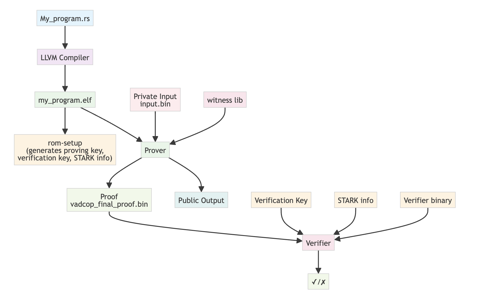

# Build and Prove

This comprehensive guide covers the complete ZisK development lifecycle, from initial program compilation through proof generation and verification. You'll learn how to build Rust programs for the ZisK VM, execute them in the emulator with comprehensive testing, collect detailed performance metrics, and generate proofs using various optimization strategies.

The guide is structured to provide both practical step-by-step instructions and deep technical understanding of each phase in the ZisK development process.

## Prerequisites

Before following this guide, make sure you have:

1. **[Installation](./installation.md)** — ZisK toolchain installed
2. **[Setup](../developer/setup.md)** — Modified your Rust program for ZisK compatibility
3. **[I/O Model](../developer/io.md)** — Understanding of how input/output works in ZisK

## Table of Contents

- [1. Build Your Program](#1-build-your-program)
- [2. Test Your Program](#2-test-your-program)
- [3. Program Setup](#3-program-setup)
- [4. Generate Proof](#4-generate-proof)
- [5. Verify Proof](#5-verify-proof)
- [Next Steps](#next-steps)
- [Command Reference](#command-reference)

---

## Development Workflow


The diagram below illustrates the complete ZisK development lifecycle, from initial program creation through proof generation and verification. The workflow consists of several interconnected phases:



- **Source to Binary**: Your Rust source code (`My_program.rs`) is compiled using the LLVM compiler to produce a RISC-V ELF binary (`my_program.elf`) that can execute within the ZisK VM.

- **Setup Phase**: The `rom-setup` process generates essential cryptographic parameters including the proving key, verification key, and STARK info files. These are program-specific and must be regenerated whenever your program changes.

- **Proof Generation**: The prover combines your compiled program, private input data (`input.bin`), and the witness library to generate a cryptographic proof (`vadcop_final_proof.bin`) that demonstrates correct execution without revealing private information.

- **Verification**: The verifier uses the generated proof, public output, verification key, STARK info, and verifier binary to cryptographically validate that the program executed correctly, producing a final ✓/✗ result.

This end-to-end process ensures both the correctness of your program execution and the privacy of your input in the ZisK environment.

---

## 1. Build Your Program

> **Prerequisite**: Make sure you have [written your program](../developer/setup.md) and understand the [I/O model](../developer/io.md) before building.

### Overview

The compilation process transforms your Rust source code into a RISC-V ELF binary that can execute within the ZisK VM. This cross-compilation process involves several critical steps that ensure your program is compatible with ZisK's execution environment and constraints.

### Development vs Production Builds

Before compiling for ZisK, you can test your program on the native architecture using standard Rust tooling:

```bash
cargo run
```

This allows you to verify program logic, debug issues, and ensure correctness before the more complex ZisK compilation process.

### ZisK Compilation Process

Once your program is ready to run on ZisK, compile it into an ELF file (RISC-V architecture), using the `cargo-zisk` CLI tool:

```bash
cargo-zisk build
```

This command compiles the program using the `zisk` target. The resulting ELF file (without extension) is generated in the `./target/riscv64ima-zisk-zkvm-elf/debug` directory.

For production, compile the ELF file with the `--release` flag:

```bash
cargo-zisk build --release
```

In this case, the ELF file will be generated in the `./target/riscv64ima-zisk-zkvm-elf/release` directory.

### Build Artifacts

The compilation process generates several important artifacts:
- **ELF Binary**: The main executable file (no extension)
- **Debug Symbols**: For troubleshooting and performance analysis
- **Metadata**: ZisK-specific metadata for proof generation

## 2. Test Your Program

> **Prerequisite**: You need your [input data](../developer/io.md) ready in `input.bin` format.

### Overview

Testing your compiled program using the ZisK emulator (`ziskemu`) is a critical step that validates program correctness before proof generation. The emulator provides a safe environment to verify execution behavior, debug issues, and collect performance metrics without the computational overhead of proof generation.

### Execution Methods

You can test your compiled program using the ZisK emulator (`ziskemu`) before generating a proof. Use the `-e` (`--elf`) flag to specify the location of the ELF file and the `-i` (`--inputs`) flag to specify the location of the input file:

```bash
cargo-zisk build --release
ziskemu -e target/riscv64ima-zisk-zkvm-elf/release/your_program -i build/input.bin
```

Alternatively, you can build and execute the program in the ZisK emulator with a single command:

```bash
cargo-zisk run --release -i build/input.bin
```

### Handling Large Programs

Complex programs may require extensive execution steps, potentially exceeding default limits. If you encounter this error:

```
Error during emulation: EmulationNoCompleted
Error: Error executing Run command
```

To resolve this, you can increase the number of execution steps using the `-n` (`--max-steps`) flag:

```bash
ziskemu -e target/riscv64ima-zisk-zkvm-elf/release/your_program -i build/input.bin -n 10000000000
```

**When to increase step limits:**
- Complex cryptographic operations
- Large data processing tasks
- Programs with extensive loops or recursion
- Memory-intensive computations

### Performance Analysis

Comprehensive performance analysis is essential for optimizing ZisK programs and understanding resource requirements for proof generation.

#### Performance Metrics

You can get performance metrics related to the program execution in ZisK using the `-m` (`--log-metrics`) flag in the `cargo-zisk run` command or in `ziskemu` tool:

```bash
cargo-zisk run --release -i build/input.bin -m
```

Or

```bash
ziskemu -e target/riscv64ima-zisk-zkvm-elf/release/your_program -i build/input.bin -m
```

The output will include details such as execution time, throughput, and clock cycles per step:

```
process_rom() steps=85309 duration=0.0009 tp=89.8565 Msteps/s freq=3051.0000 33.9542 clocks/step
```

#### Execution Statistics

You can get statistics related to the program execution in ZisK using the `-x` (`--stats`) flag in the `cargo-zisk run` command or in `ziskemu` tool:

```bash
cargo-zisk run --release -i build/input.bin -x
```

Or

```bash
ziskemu -e target/riscv64ima-zisk-zkvm-elf/release/your_program -i build/input.bin -x
```

The output will include details such as cost definitions, total cost, register reads/writes, opcode statistics, etc:

```
Cost definitions:
    AREA_PER_SEC: 1000000 steps
    COST_MEMA_R1: 0.00002 sec
    COST_MEMA_R2: 0.00004 sec
    COST_MEMA_W1: 0.00004 sec
    COST_MEMA_W2: 0.00008 sec
    COST_USUAL: 0.000008 sec
    COST_STEP: 0.00005 sec

Total Cost: 12.81 sec
    Main Cost: 4.27 sec 85308 steps
    Mem Cost: 2.22 sec 222052 steps
    Mem Align: 0.05 sec 2701 steps
    Opcodes: 6.24 sec 1270 steps (81182 ops)
    Usual: 0.03 sec 4127 steps
    Memory: 135563 a reads + 1625 na1 reads + 10 na2 reads + 84328 a writes + 524 na1 writes + 2 na2 writes = 137198 reads + 84854 writes = 222052 r/w

Opcodes:
    flag: 0.00 sec (0 steps/op) (89 ops)
    copyb: 0.00 sec (0 steps/op) (10568 ops)
    add: 1.12 sec (77 steps/op) (14569 ops)
    ltu: 0.01 sec (77 steps/op) (101 ops)
    ...
    xor: 1.06 sec (77 steps/op) (13774 ops)
    signextend_b: 0.03 sec (109 steps/op) (320 ops)
    signextend_w: 0.03 sec (109 steps/op) (320 ops)
```

## 3. Program Setup

### Overview

Program setup is a critical initialization step that generates the necessary parameters and constraints for proof generation. This process creates a proving key and associated metadata that are specific to your program's structure and cannot be reused across different programs.

### When Setup is Required

Setup must be performed:
- **First time**: After building any new program ELF file
- **Program changes**: Whenever the program logic, dependencies, or structure changes
- **Clean builds**: After running `cargo-zisk clean`

### Generating Setup Files

Before generating a proof (or verifying the constraints), you need to generate the program setup files. This must be done the first time after building the program ELF file, or any time it changes:

```bash
cargo-zisk rom-setup -e target/riscv64ima-zisk-zkvm-elf/release/your_program -k $HOME/.zisk/provingKey
```

In this command:
- `-e` (`--elf`) specifies the ELF file location.
- `-k` (`--proving-key`) specifies the directory containing the proving key. This is optional and defaults to `$HOME/.zisk/provingKey`.

The program setup files will be generated in the `cache` directory located at `$HOME/.zisk`.

### Setup Artifacts

The setup process generates several critical files in `$HOME/.zisk/cache/`:

- **Proving Key**: Cryptographic parameters for proof generation
- **Constraint Files**: Zero-knowledge constraint definitions
- **Metadata**: Program-specific configuration and parameters
- **Verification Keys**: Public parameters for proof verification

### Cache Management

To clean the cache directory content, use the following command:

```bash
cargo-zisk clean
```

**When to clean cache:**
- Switching between different programs
- Resolving setup-related errors
- Freeing disk space
- Starting fresh development cycle

**Warning:** Cleaning cache requires re-running setup before proof generation.

## 4. Generate Proof

### Overview

Proof generation is the core process that creates a zk proof of execution demonstrating the correct execution of your program. This computationally intensive process validates that your program executed correctly without revealing the private inputs or internal computations.

### Prerequisites

Before generating a proof, ensure:
- Program has been built and tested successfully
- Setup files have been generated
- Input data is prepared and validated
- Sufficient computational resources are available

**What to expect:**
- Proof generation is computationally intensive and will take 1-3 minutes for this simple program
- Memory usage: ~25GB RAM required
- You'll see progress logs as the proof generates

### Step 1: Constraint Verification

Before generating a proof (which can take some time), you can verify that all constraints are satisfied:

```bash
LIB_EXT=$([[ "$(uname)" == "Darwin" ]] && echo "dylib" || echo "so")
cargo-zisk verify-constraints -e target/riscv64ima-zisk-zkvm-elf/release/your_program -i build/input.bin -w $HOME/.zisk/bin/libzisk_witness.$LIB_EXT -k $HOME/.zisk/provingKey
```

In this command:
- `-e` (`--elf`) specifies the ELF file location.
- `-i` (`--input`) specifies the input file location.
- `-w` (`--witness`) specifies the location of the witness library. This is optional and defaults to `$HOME/.zisk/bin/libzisk_witness.$LIB_EXT`.
- `-k` (`--proving-key`) specifies the directory containing the proving key. This is optional and defaults to `$HOME/.zisk/provingKey`.

**Successful verification output:**
```
[INFO ] GlCstVfy: --> Checking global constraints
[INFO ] CstrVrfy: ··· ✓ All global constraints were successfully verified
[INFO ] CstrVrfy: ··· ✓ All constraints were verified
```

### Step 2: Proof Generation

To generate and verify a proof, execute:

```bash
LIB_EXT=$([[ "$(uname)" == "Darwin" ]] && echo "dylib" || echo "so")
cargo-zisk prove -e target/riscv64ima-zisk-zkvm-elf/release/your_program -i build/input.bin -w $HOME/.zisk/bin/libzisk_witness.$LIB_EXT -k $HOME/.zisk/provingKey -o proof -a -y
```

**Command breakdown:**
- `-o proof`: Save proof files to ./proof directory
- `-a`: Generate aggregated proof (combines sub-proofs into final proof)
- `-y`: Verify the proof immediately after generation

This process will take 1-3 minutes depending on your hardware. You'll see progress logs as it executes. If successful, you'll see:

```
[INFO ] ProofMan:     ✓ Vadcop Final proof was verified
[INFO ]      stop <<< GENERATING_VADCOP_PROOF 91706ms
[INFO ] ProofMan: Proofs generated successfully
```

### Proof Generation Process

The proof generation involves several steps:

1. **Witness Generation**: Create execution trace from program run
2. **Constraint Satisfaction**: Verify all zero-knowledge constraints
3. **Polynomial Commitments**: Generate cryptographic commitments
4. **Proof Assembly**: Combine components into final proof
5. **Verification**: Validate the generated proof

### Performance Considerations

- **Time**: Proof generation can take minutes to hours depending on program complexity
- **Memory**: Requires significant RAM (typically 25GB+ per process)
- **CPU**: Computationally intensive, benefits from multi-core systems
- **Storage**: Generated proofs can be several GB in size

---

## 5. Verify Proof

### Overview

Proof verification is the final step that validates the generated proof without requiring access to private inputs or the original program execution. This process ensures the proof is mathematically sound and correctly demonstrates program execution.

### Verification Process

```bash
cargo-zisk verify -p ./proof/vadcop_final_proof.bin -s $HOME/.zisk/provingKey/zisk/vadcop_final/vadcop_final.starkinfo.json -e $HOME/.zisk/provingKey/zisk/vadcop_final/vadcop_final.verifier.bin -k $HOME/.zisk/provingKey/zisk/vadcop_final/vadcop_final.verkey.json
```
---

## Next Steps

### Additional Resources

> **See also:** [Glossary](../glossary.md) for complete command reference and technical definitions.
